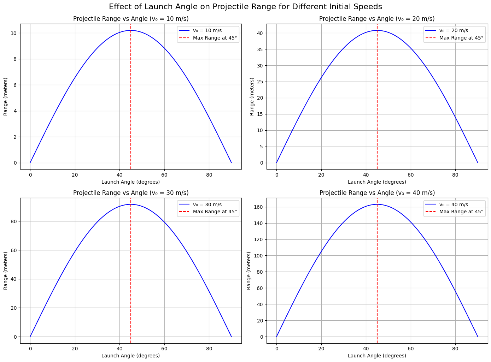

# Problem 1: Investigating the Range as a Function of the Angle of Projection aaaa

## 1. Theoretical Foundation

Projectile motion describes the path of an object launched into the air and influenced only by gravity (no air resistance).

When an object is projected with an initial speed $v_0$ at an angle $\theta$ above the horizontal, its motion can be broken into two components:

- **Horizontal velocity**: $v_{0x} = v_0 \cos(\theta)$  
- **Vertical velocity**: $v_{0y} = v_0 \sin(\theta)$

Gravity only affects the vertical motion. Using physics equations of motion, the path of the projectile is a parabola.

**Time of Flight** (assuming launch and landing at the same height):

$$
T = \frac{2v_0 \sin(\theta)}{g}
$$

**Horizontal Range**:

\[
\begin{aligned}
R &= v_{0x} \cdot T \\
  &= v_0 \cos(\theta) \cdot \frac{2v_0 \sin(\theta)}{g} \\
  &= \frac{v_0^2 \sin(2\theta)}{g}
\end{aligned}
\]

This equation shows that the range depends on both the speed and the angle of launch.

**Key Insight**:  
The maximum range is achieved at $\theta = 45^\circ$

The range is symmetric: angles that add to $90^\circ$ (like $30^\circ$ and $60^\circ$) give the same range.

---

## 2. Analysis of the Range

### How does the angle affect the range?

- When angle is too small, the object moves more horizontally but doesn't stay in the air long.
- When angle is too steep, it goes high but not far.
- $45^\circ$ gives the perfect balance for maximum horizontal distance.

### Influence of Other Parameters:

- **Initial velocity ($v_0$)**: The range increases quadratically with speed. Doubling the speed makes the range four times longer.
- **Gravity ($g$)**: Range is inversely related to gravity. On the Moon, with lower gravity, the same throw would go farther.
- **Initial height ($h$)**: If launched from above ground level, the range increases because the object stays in the air longer.

---

## 3. Practical Applications

Projectile motion isn’t just academic—it appears in:

- **Sports**: Calculating the optimal angle to throw a ball or kick a football.
- **Engineering**: Designing projectiles or launch systems (e.g., missiles, fireworks).
- **Astrophysics**: Determining orbits and escape trajectories for spacecraft.
- **Games and Simulations**: Animating realistic motion of objects.

**In real life**, we also must account for:

- Air resistance (slows the object down)
- Wind (can push the object off course)
- Spin or lift effects (e.g., Magnus effect on spinning balls)

---

## 4. Summary of Key Points

- The range of a projectile depends on its launch angle and initial speed.
- Without air resistance, the formula 
  $$
  R = \frac{v_0^2 \sin(2\theta)}{g}
  $$
  accurately describes the range.
- Maximum range occurs at $45^\circ$ on flat ground.
- Real-world conditions (drag, wind, terrain) change the result and require more advanced modeling.

---

 
 ## colab  
[problem](https://colab.research.google.com/drive/12r4Xn-vQIT7mlLmU0O2oK2e-jbt_GSrh?usp=sharing)

