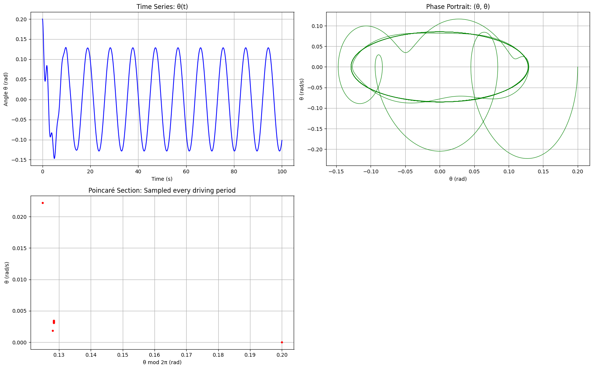

# Problem 2
# 📚 Theoretical Foundation

## ⚖️ Equation of Motion

The motion of a forced damped pendulum is governed by the nonlinear differential equation:

$$
\[
\frac{d^2\theta}{dt^2} + b \frac{d\theta}{dt} + \frac{g}{L} \sin\theta = A \cos(\omega t)
\]
$$

Where:

- $\theta(t)$: angle of the pendulum  
- $b$: damping coefficient  
- $g$: gravitational acceleration  
- $L$: length of the pendulum  
- $A$: amplitude of external forcing  
- $\omega$: driving frequency

---

## 🔄 Small-Angle Approximation

When $|\theta| < 0.2$ rad (≈ 11°), use $\sin\theta \approx \theta$. The equation simplifies to:

$$
\[
\frac{d^2\theta}{dt^2} + b \frac{d\theta}{dt} + \frac{g}{L} \theta = A \cos(\omega t)
\]
$$

This is a linear second-order ODE with sinusoidal forcing. Its general solution is:

$$\[
\theta(t) = \theta_{\text{homogeneous}}(t) + \theta_{\text{particular}}(t)
\]$$

- $\theta_{\text{homogeneous}}(t)$: decays over time due to damping  
- $\theta_{\text{particular}}(t)$: oscillates at the driving frequency $\omega$

---

## 🎯 Resonance

Occurs when $\omega$ is near the system's natural frequency:

$$\[
\omega_0 = \sqrt{\frac{g}{L}}
\]$$

At resonance, even small forces can produce large amplitude oscillations unless damping is significant.

---

# 🔍 Analysis of Dynamics

We analyze the effect of parameters:

- **Damping $b$**: Reduces amplitude, can suppress chaos.
- **Driving amplitude $A$**: Higher amplitude → more energy → more likely chaos.
- **Driving frequency $\omega$**: Can trigger resonance or chaos depending on value.

### 🌀 Regular vs Chaotic Motion

- **Regular**: Motion is periodic and predictable. Phase portraits are smooth.
- **Chaotic**: Sensitive to initial conditions, aperiodic, and exhibits strange attractors in phase space.

---

# ⚙️ Practical Applications

| System              | Description                                              |
|---------------------|----------------------------------------------------------|
| Suspension bridges  | Subject to periodic wind forces (e.g., Tacoma Narrows)   |
| Clocks              | Pendulums under damping and external driving             |
| Energy harvesting   | Convert oscillations into electricity                    |
| Electronic circuits | Analogous behavior in driven RLC circuits                |

---

# 💻 Implementation in Python

Key features of the numerical simulation include:

- Use of `solve_ivp` for numerical integration
- Time evolution plots of $\theta(t)$
- Phase portraits in $(\theta, \dot{\theta})$ space
- Poincaré sections sampled at multiples of driving period

You can vary $b$, $A$, and $\omega$ to explore different dynamical regimes.

---

# 📈 Visualization Tools

- **Time series**: $\theta(t)$ over time
- **Phase portrait**: $(\theta, \dot{\theta})$ shows periodic or chaotic nature
- **Poincaré section**: Sampled every driving period; chaos appears as scattered points
- **Bifurcation diagram**: Final angles vs. $A$ show transitions to chaos

---

# ⚠️ Model Limitations & Extensions

- The small-angle approximation ($\sin\theta \approx \theta$) is only valid for small $\theta$
- Real-world systems may have:
  - Nonlinear or velocity-dependent damping
  - Non-periodic or random external forces

**Extensions:**

- Double pendulums  
- Stochastic or noise-driven systems  
- Discrete-time maps (e.g., kicked rotor)

---

## colab 
[problem](https://colab.research.google.com/drive/1J5SayOpCpayaqOxBDFi1ajdIQSsLKFTR?usp=sharing)

