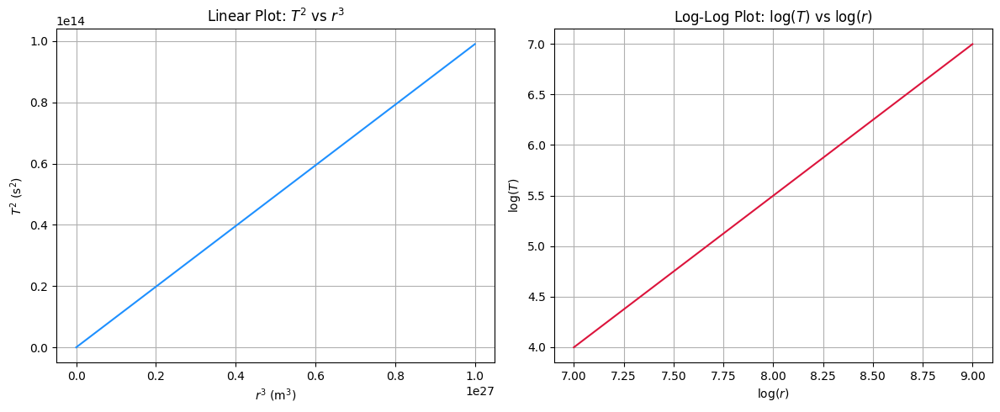

# Problem 1 # 🪐 Problem 1: Orbital Period and Orbital Radius  
### *(Kepler’s Third Law for Circular Orbits)*

---

## 📌 Motivation

Understanding how celestial bodies move under the influence of gravity is a foundation of astronomy and space science. One of the most elegant relationships governing orbital motion is **Kepler’s Third Law**, which links how long a body takes to orbit a central mass to how far it is from that mass. This allows scientists to calculate orbital distances, periods, and even masses of planets and stars using observable data.

---

## 📐 Derivation of Kepler’s Third Law (Circular Orbits)

We begin by considering a small mass $m$ (e.g., a satellite or planet) orbiting a much larger central mass $M$ (e.g., Earth or the Sun) in a circular orbit of radius $r$.

### Step 1: Newton’s Law of Gravitation

The gravitational force acting on $m$ is:

$$
F_{\text{gravity}} = \frac{G M m}{r^2}
$$

Where:

- $G = 6.674 \times 10^{-11} \, \text{N} \cdot \text{m}^2/\text{kg}^2$ is the gravitational constant  
- $M$ is the mass of the central body  
- $r$ is the orbital radius

---

### Step 2: Centripetal Force for Circular Motion

The mass $m$ moves in a circle, so the required centripetal force is:

$$
F_{\text{centripetal}} = \frac{m v^2}{r}
$$

Set the gravitational force equal to the centripetal force:

$$
\frac{G M m}{r^2} = \frac{m v^2}{r}
$$

Cancel $m$ and solve for orbital speed $v$:

$$
v^2 = \frac{G M}{r}
$$

---

### Step 3: Express the Orbital Period $T$

The time to complete one orbit is:

$$
T = \frac{2 \pi r}{v}
$$

Substitute $v = \sqrt{\frac{G M}{r}}$:

$$
T = \frac{2 \pi r}{\sqrt{\frac{G M}{r}}} = 2 \pi \sqrt{\frac{r^3}{G M}}
$$

Now square both sides:

$$
T^2 = \frac{4 \pi^2 r^3}{G M}
$$

---

### ✅ Final Form (Kepler’s Third Law)

$$
T^2 \propto r^3
$$

This means: the square of the orbital period is directly proportional to the cube of the orbital radius, with a proportionality constant that depends only on the central mass $M$.

---

## 🌌 Astronomical Implications

### 1. Calculating Masses of Planets and Stars

If $T$ and $r$ of a satellite or planet are known, rearranging the formula gives:

$$
M = \frac{4 \pi^2 r^3}{G T^2}
$$

This is used to:

- Determine Earth’s mass using satellite orbits  
- Calculate the mass of the Sun based on planetary periods  
- Measure the mass of stars hosting exoplanets using their orbital motion

---

### 2. Determining Distances

If the orbital period is observed (e.g., for a moon or artificial satellite), we can solve for $r$:

$$
r = \left( \frac{G M T^2}{4 \pi^2} \right)^{1/3}
$$

Used in:

- GPS satellite placement  
- Tracking orbital decay of space stations  
- Determining planetary distances in other solar systems

---

## 🌕 Real-World Example: The Moon’s Orbit Around Earth

Given:

- $M_{\text{Earth}} = 5.972 \times 10^{24} \, \text{kg}$  
- $r = 3.844 \times 10^8 \, \text{m}$  
- $G = 6.674 \times 10^{-11}$

Using:

$$
T = 2 \pi \sqrt{\frac{r^3}{G M}}
$$

Insert values:

$$
T = 2 \pi \sqrt{\frac{(3.844 \times 10^8)^3}{6.674 \times 10^{-11} \cdot 5.972 \times 10^{24}}}
$$

Result:

$$
T \approx 2.36 \times 10^6 \, \text{seconds} \approx 27.3 \, \text{days}
$$

✅ This matches the actual sidereal month (time Moon takes to orbit Earth once) almost exactly!

---

## 📈 Graphical Interpretation

- If you plot $T^2$ (orbital period squared) on the vertical axis against $r^3$ (orbital radius cubed) on the horizontal axis, you get a **straight line**, demonstrating $T^2 \propto r^3$.
- A **log-log plot** of $T$ vs $r$ shows a straight line with slope = $3/2$, again confirming the power-law relationship.

---

## 🪐 Extension to Elliptical Orbits

Kepler's Third Law still holds if the orbit is elliptical, with the **semi-major axis** $a$ replacing the orbital radius $r$:

$$
T^2 = \frac{4 \pi^2 a^3}{G M}
$$

Applications:

- Describes planetary orbits, which are elliptical  
- Used to plan interplanetary spacecraft trajectories (e.g., Hohmann transfers)  
- Used in analyzing exoplanet orbits via light curves and Doppler shifts

---

## 🧠 Conclusion

Kepler’s Third Law elegantly connects time and space in planetary motion:

$$
T^2 = \frac{4 \pi^2 r^3}{G M}
$$

It plays a central role in:

- Determining masses and distances in astronomy  
- Predicting orbital periods  
- Understanding both artificial satellite motion and the structure of planetary systems

---

## colab 
[solution](https://colab.research.google.com/drive/1Y8ooW1qSZpVIhneDtzyoEZ23CvHN_rS3?usp=sharing)