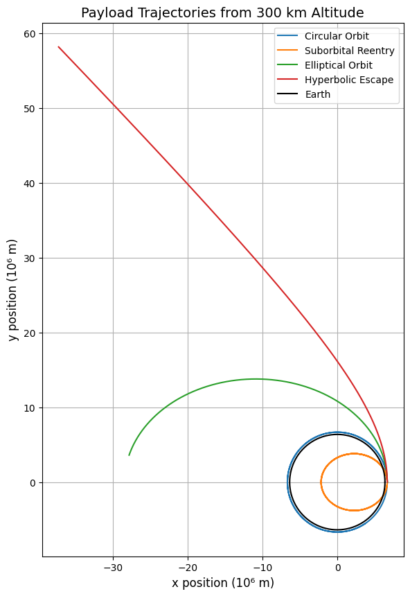
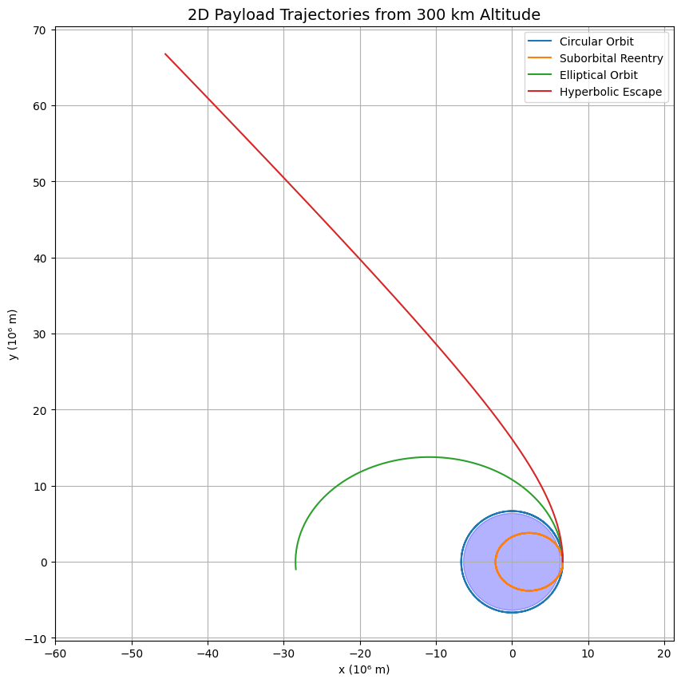

# Problem 3

# Problem 3: Trajectories of a Freely Released Payload Near Earth

🎯 **Motivation**

When a payload is released from a moving rocket near Earth, its future path is determined by its initial position and velocity, as well as the influence of Earth’s gravity. Depending on these conditions, the payload may reenter the atmosphere, enter orbit, or escape Earth’s gravitational field entirely. This problem is central to satellite deployment, space station servicing, and interplanetary mission planning.

To understand and predict these trajectories, we combine Newtonian gravity with numerical simulation. This enables the classification and analysis of different orbital regimes and helps visualize the sensitive dependence on initial conditions.

🧠 **Theoretical Background**

The motion of the payload is governed by Newton’s Law of Universal Gravitation and Newton’s Second Law of Motion. The gravitational force acting on the payload is:

$$
\vec{F} = -\frac{G M_e m}{r^2} \hat{r}
$$

Where:

- $G$ is the gravitational constant  
- $M_e$ is the mass of Earth  
- $m$ is the mass of the payload  
- $r$ is the distance from Earth’s center  
- $\hat{r}$ is the unit vector pointing from the payload to Earth’s center  

Using Newton’s Second Law, $\vec{F} = m \vec{a}$, we derive the equation of motion:

$$
\ddot{\vec{r}} = -\frac{G M_e}{|\vec{r}|^3} \vec{r}
$$

This vector differential equation describes how the position vector $\vec{r}$ evolves over time due to Earth’s gravity. The nature of the resulting trajectory depends on the magnitude and direction of the payload’s velocity at release.

---

### **Types of Trajectories**

The form of the trajectory depends on the total mechanical energy (kinetic + potential) of the payload:

#### Circular Orbit
Occurs when the payload has just enough velocity to maintain a constant distance from Earth. The required circular velocity is:

$$
v_\text{circular} = \sqrt{\frac{G M_e}{r}}
$$

#### Elliptical Orbit
If the velocity is less than escape velocity but not tuned for a circular path, the payload follows an elliptical orbit.

#### Parabolic Escape Trajectory
If the payload has exactly the escape velocity:

$$
v_\text{escape} = \sqrt{\frac{2 G M_e}{r}}
$$

It follows a parabolic path and asymptotically escapes Earth’s gravity.

#### Hyperbolic Trajectory
When the velocity exceeds the escape velocity, the payload follows an open, hyperbolic path and escapes with residual speed.

#### Suborbital (Reentry)
If the payload has insufficient velocity for a stable orbit, it eventually returns to Earth’s surface.

---

🧮 **Numerical Simulation**

Analytically solving the gravitational equations of motion is only feasible for idealized cases. For arbitrary initial conditions and realistic mission scenarios, numerical simulation is required.

The trajectory of the payload is determined by integrating the second-order differential equation:

$$
\ddot{\vec{r}} = -\frac{G M_e}{|\vec{r}|^3} \vec{r}
$$

This is reformulated as a system of first-order differential equations by introducing the velocity vector $\vec{v} = \dot{\vec{r}}$. The numerical solver then steps through small time increments, updating position and velocity based on the local acceleration caused by Earth’s gravity.

**Key parameters for simulation:**

- **Initial Position**: Defined by the altitude of release above Earth's surface.
- **Initial Velocity**: Both magnitude and direction affect the outcome.
- **Integration Time**: Determines how far the simulation runs into the future.

Using a standard ODE integrator, such as Runge-Kutta methods, we simulate the motion and track the trajectory in 2D space. The Earth is modeled as a stationary massive body, and atmospheric drag is neglected for simplicity.

---

🔬 **Example Simulations and Interpretation**

To demonstrate the different types of trajectories, we simulate the release of a payload from 300 km above Earth’s surface, changing only the magnitude of the initial velocity while keeping the direction tangential to the surface.

Let:

$$
r = R_e + h, \quad \text{where} \quad R_e = \text{Earth’s radius}, \quad h = 300\,\text{km}
$$

Then:

$$
v_\text{circular} = \sqrt{\frac{G M_e}{r}}, \quad v_\text{escape} = \sqrt{2} \cdot v_\text{circular}
$$

We analyze four distinct cases:

---

### 1. Circular Orbit

- **Velocity**: Exactly $v_\text{circular}$
- **Result**: The payload enters a stable circular orbit, maintaining constant altitude.

---

### 2. Suborbital Reentry

- **Velocity**: Less than $v_\text{circular}$, e.g., 70% of it  
- **Result**: The payload follows a curved path but lacks the velocity to sustain orbit and eventually reenters Earth’s atmosphere.

---

### 3. Elliptical Orbit

- **Velocity**: Between $v_\text{circular}$ and $v_\text{escape}$  
- **Result**: The payload follows a closed elliptical orbit, reaching different altitudes throughout its motion.

---

### 4. Hyperbolic Escape Trajectory

- **Velocity**: Greater than $v_\text{escape}$, e.g., 110% of it  
- **Result**: The payload escapes Earth’s gravity along a hyperbolic path, never to return.

---

### **Interpretation**

The outcome of a payload release depends sensitively on the initial speed and direction. A small change can transition a trajectory from bound to unbound. These results are critical in:

- **Orbital Insertion**: Achieving precise speed to maintain orbit  
- **Reentry Prediction**: Ensuring suborbital payloads return safely  
- **Interplanetary Missions**: Achieving escape velocity to leave Earth  

Understanding these dynamics enables better mission planning, more efficient fuel use, and safer satellite and spacecraft deployment strategies.

---

### colab

[solution](https://colab.research.google.com/drive/1Y8ooW1qSZpVIhneDtzyoEZ23CvHN_rS3?usp=sharing)