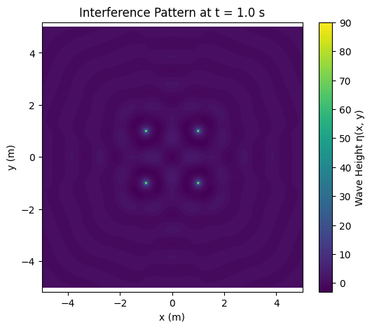
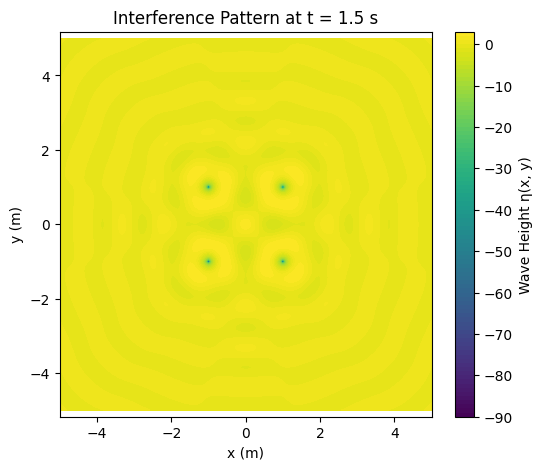

# Problem 1

# 📘 Problem 1: Interference Patterns on a Water Surface

## 🔍 What Is Interference?

When two or more waves meet on a surface (like water), they combine. This combination is called **interference**. It can happen in two main ways:

- **Constructive interference**: Waves add together to make a larger wave.
- **Destructive interference**: Waves cancel each other out, resulting in a flat surface.

On a water surface, this can be seen as bright and dark patterns—like ripples overlapping.

---

## 📐 Choosing a Setup: Regular Polygon

Let’s use a **square** as our regular polygon. That means we place **4 identical wave sources** at the corners of a square. Each one sends out circular waves on the water.

---

## 📘 Wave Equation (From One Source)

Each point source creates a wave described by:

$$
\eta(x, y, t) = \frac{A}{r} \cos(kr - \omega t + \phi)
$$

Where:

- $\eta(x, y, t)$: Height of the wave at point $(x, y)$ and time $t$
- $A$: Amplitude of the wave
- $r = \sqrt{(x - x_0)^2 + (y - y_0)^2}$: Distance from the source at $(x_0, y_0)$ to the point $(x, y)$
- $k = \frac{2\pi}{\lambda}$: Wave number, related to the wavelength $\lambda$
- $\omega = 2\pi f$: Angular frequency, related to the frequency $f$
- $\phi$: Initial phase (can be the same for all sources)

---

## 🧠 Superposition of Waves

If we have 4 sources (like in the square), the total wave height at any point is the sum of the waves from each source:

$$
\eta_{\text{total}}(x, y, t) = \eta_1 + \eta_2 + \eta_3 + \eta_4
$$

This means we just add up the contributions from each source, based on how far each one is from the point we’re looking at.

---

## 🎨 What Does the Pattern Look Like?

The result is a complex **interference pattern** that looks like ripples overlapping in a structured way. What you’ll see:

- Symmetrical patterns, matching the square shape
- Regions of high wave height (**constructive interference**), forming bright lobes or rings
- Regions of low or zero wave height (**destructive interference**), where the waves cancel each other

This pattern stays **steady in space** (assuming time is fixed), and it **changes dynamically** if you let time move.

---

## 🔍 Real-World Applications

- **Sonar and radar** systems use interference patterns to detect objects
- **Optics**: Similar patterns happen with light in **double-slit experiments**
- **Acoustics**: Speaker setups in rooms create interference zones

---

## ✅ Summary

- **Interference** happens when waves from multiple sources overlap.
- You placed wave sources at the **corners of a square**.
- The waves from each source interact across the water surface.
- The final pattern shows areas where waves **reinforce or cancel** each other.
- The shape of the pattern depends on the **number and placement of sources**.

---

## colab 

[solution](https://colab.research.google.com/drive/1Y8ooW1qSZpVIhneDtzyoEZ23CvHN_rS3?usp=sharing)
