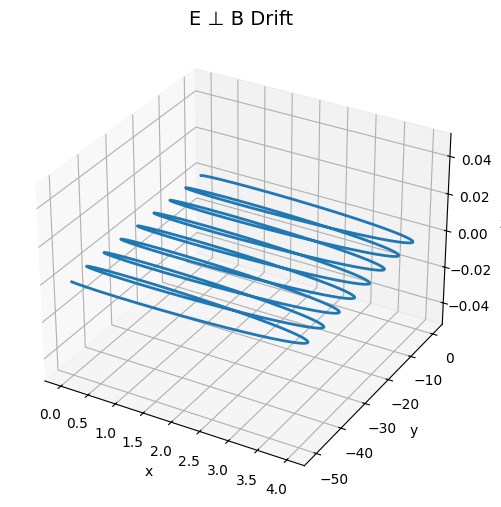

# Problem 1# Problem 1: Simulating the Effects of the Lorentz Force

🎯 **Motivation**

The Lorentz force equation:

$$
\vec{F} = q\vec{E} + q\vec{v} \times \vec{B}
$$

describes the force experienced by a charged particle in electric ($\vec{E}$) and magnetic ($\vec{B}$) fields. This fundamental law governs the behavior of charged particles in a wide range of physical systems, from particle accelerators and mass spectrometers to astrophysical plasmas and magnetic confinement devices in fusion research.

Simulating the motion of such particles enables visualization of their dynamic paths and a deeper understanding of phenomena like cyclotron motion, helical trajectories, and drift behavior in combined fields.

---

## 1️⃣ Exploration of Applications

### 📌 Key Systems Influenced by Lorentz Force

- **Particle Accelerators**: Lorentz force bends and accelerates charged particles using magnetic and electric fields.
- **Mass Spectrometers**: Use magnetic fields to separate ions by mass-to-charge ratio.
- **Plasma Confinement Devices (e.g., Tokamaks)**: Use magnetic fields to confine high-temperature plasma.
- **Cathode Ray Tubes (CRTs)**: Deflect electron beams using electric and magnetic fields.
- **Auroras and Cosmic Rays**: Charged particles spiral along Earth’s magnetic field lines.

### 📌 Importance of Fields

- **Electric Field ($\vec{E}$)**: Accelerates particles linearly.
- **Magnetic Field ($\vec{B}$)**: Bends the path of particles, causing circular or helical motion.

The cross product $\vec{v} \times \vec{B}$ ensures that the magnetic force is always perpendicular to the particle’s velocity — causing rotation or curvature, not acceleration along the velocity vector.

---

## 2️⃣ Simulating Particle Motion (Conceptual Explanation)

The motion of a particle of mass $m$ and charge $q$ under Lorentz force is governed by Newton’s second law:

$$
m \frac{d\vec{v}}{dt} = q\vec{E} + q\vec{v} \times \vec{B}
$$

This yields coupled differential equations for velocity and position, depending on field configurations.

---

### 🔁 Case 1: Uniform Magnetic Field Only

Set $\vec{E} = 0$

Resulting force:

$$
\vec{F} = q\vec{v} \times \vec{B}
$$

- Particle moves in a circular path in a plane perpendicular to $\vec{B}$.

- **Larmor radius** (radius of circular motion):

$$
r = \frac{mv_\perp}{qB}
$$

- **Cyclotron frequency** (angular velocity):

$$
\omega = \frac{qB}{m}
$$

---

### 🔁 Case 2: Uniform Electric and Magnetic Fields

- If parallel ($\vec{E} \parallel \vec{B}$): Particle accelerates linearly along field lines → **spiral motion**.

- If crossed ($\vec{E} \perp \vec{B}$):

**E × B drift:**

$$
\vec{v}_{\text{drift}} = \frac{\vec{E} \times \vec{B}}{B^2}
$$

Overall motion: combination of circular motion due to $\vec{B}$ and uniform drift due to $\vec{E}$.

---

### 🔁 Case 3: Only Electric Field (No Magnetic Field)

Particle undergoes **linear acceleration**:

$$
\vec{a} = \frac{q\vec{E}}{m}
$$

---

## 3️⃣ Parameter Exploration

| Parameter           | Effect |
|---------------------|--------|
| Electric Field ($E$) | Increases linear acceleration or drift. |
| Magnetic Field ($B$) | Decreases Larmor radius; increases circular frequency. |
| Initial Velocity ($v$) | Alters pitch of helical path or radius of circle. |
| Charge ($q$)         | Reverses direction of force if sign flips; magnitude affects curvature. |
| Mass ($m$)           | Heavier particles spiral more slowly and with larger radius. |

These variations can be explored by adjusting initial conditions and field strengths and observing how the motion evolves.

---

## 4️⃣ Visualization (Conceptually)

### 2D and 3D Trajectories to Show:

- **Uniform B-field**:
  - 2D: Circular motion in the $x$–$y$ plane.
  - 3D: If initial velocity has a component parallel to $\vec{B}$, the particle moves in a **helical path**.

- **E and B Crossed Fields**:
  - Path becomes **drifting cycloid** — spiraling while moving sideways.

### 🧭 Key Concepts

- **Larmor Radius**: Indicates strength of curvature.
- **Helical Pitch**: Determined by parallel velocity.
- **Drift Velocity**: Uniform translation of the orbit center.

---

## ✅ Discussion: Real-World Connections

| System              | Lorentz Force Role |
|---------------------|--------------------|
| Cyclotron           | Uses magnetic field to keep particles in a circular path while electric field accelerates them. |
| Mass Spectrometer   | Separates ions based on the radius of their circular motion in a magnetic field. |
| Magnetic Traps      | Confine plasma using magnetic curvature and field gradients. |
| Astrophysics        | Explains spiral motion of charged cosmic particles in Earth’s magnetic field. |

---

## 📌 Extension Ideas

- Add **non-uniform** or **time-varying fields** to model more realistic environments.
- Include **collisions** or **external forces** for plasma simulations.
- Simulate **multiple particles** interacting via Coulomb forces.

---

## 📤 Deliverables Summary (Conceptual)

| Component                | Description |
|--------------------------|-------------|
| Markdown Document        | Theoretical foundations, parameter exploration, system analysis. |
| Visualizations (Optional) | Conceptual diagrams showing 2D and 3D trajectories. |
| Discussion               | Real-world systems and interpretation of trajectory behavior. |
| Optional Code            | Euler or Runge-Kutta simulation to integrate motion equations. |

---

## colab 

[solution]()