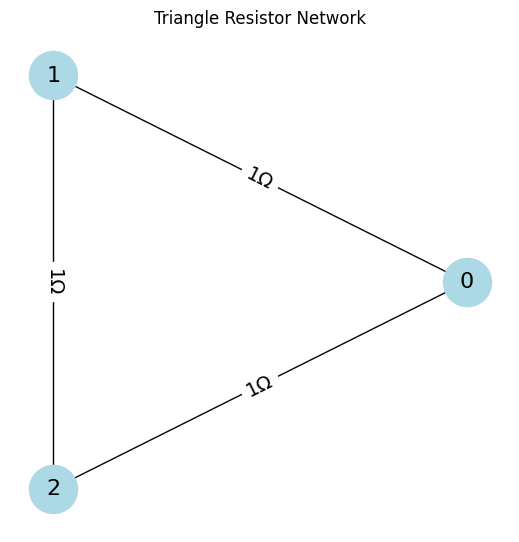
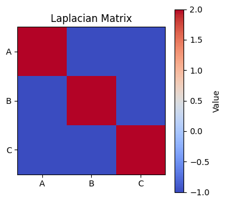

# Problem 1
# Problem 1

# 📐 Problem 1: Equivalent Resistance Using Graph Theory

## 🎯 Motivation

Calculating equivalent resistance is a fundamental task in electrical circuit analysis. Traditionally, this is done using series and parallel rules. However, for complex resistor networks, this becomes inefficient and error-prone.

Graph theory provides a systematic, scalable, and elegant approach to analyzing resistor networks. By modeling the circuit as a graph—where **nodes represent junctions** and **edges represent resistors** (with weights equal to resistance values)—we can apply tools from **linear algebra** and **matrix theory** to compute the equivalent resistance between any two nodes.

This approach is not only useful in theoretical physics and electrical engineering but is also essential for the development of **automated circuit solvers**, **network optimization algorithms**, and **simulation software**.

---

## 📘 Theoretical Background

### 🔗 Circuit as a Graph

- **Nodes** = junctions or connection points  
- **Edges** = resistors between nodes  
- **Edge Weights** = resistance values or **conductance** ($G = \frac{1}{R}$)

The circuit is modeled as a **weighted undirected graph**. The electrical properties are encoded into a matrix called the **Laplacian matrix**, derived from Kirchhoff’s laws.

---

### 🧮 Laplacian Matrix Method

Given:

- $R_{ij}$ = resistance between nodes $i$ and $j$  
- $G_{ij} = \frac{1}{R_{ij}}$ = conductance  

#### Step 1: Construct the Laplacian Matrix $L$

- $L_{ii} = \sum_j G_{ij}$ (sum of conductances at node $i$)  
- $L_{ij} = -G_{ij}$ (negative of conductance between $i$ and $j$)  

#### Step 2: Use Node Potentials

Inject 1 A current at node $a$, extract 1 A at node $b$:

$$
\vec{I} =
\begin{bmatrix}
0 \\
\vdots \\
+1 \text{ at node } a \\
\vdots \\
-1 \text{ at node } b \\
\vdots \\
0
\end{bmatrix}
$$

Set one node's potential (typically node $b$) to zero (ground).

Solve the reduced linear system:

$$
L' \vec{V} = \vec{I}'
$$

Then compute the voltage difference $V_a - V_b$.  
Since current was 1 A, by Ohm’s law:

$$
R_{\text{eq}}(a, b) = V_a - V_b
$$

---

## 🧪 Analytical Example: Triangle Circuit

### Circuit Description

Three nodes $A$, $B$, and $C$, all connected with $1\,\Omega$ resistors:

$$
R_{AB} = R_{BC} = R_{CA} = 1\,\Omega
$$

Goal: Find the **equivalent resistance between A and B**.

Label:

- Node A → 1  
- Node B → 2  
- Node C → 3

---

### Step-by-Step Solution (No Programming)

#### 1. Construct the Laplacian Matrix

Each node has two connections (each with conductance $1\,\text{S}$):

$$
L =
\begin{bmatrix}
2 & -1 & -1 \\
-1 & 2 & -1 \\
-1 & -1 & 2
\end{bmatrix}
$$

#### 2. Define Current Injection Vector

Inject 1 A into node 1 (A), extract 1 A at node 2 (B):

$$
\vec{I} =
\begin{bmatrix}
1 \\
-1 \\
0
\end{bmatrix}
$$

#### 3. Ground Node B (set $V_2 = 0$)

Now reduce the system to unknown voltages $V_1$ and $V_3$:

$$
\begin{bmatrix}
2 & -1 \\
-1 & 2
\end{bmatrix}
\begin{bmatrix}
V_1 \\
V_3
\end{bmatrix}
=
\begin{bmatrix}
1 \\
0
\end{bmatrix}
$$

#### 4. Solve the System

From the second equation:

$$
- V_1 + 2V_3 = 0 \Rightarrow V_1 = 2V_3
$$

Substitute into the first equation:

$$
2(2V_3) - V_3 = 1 \Rightarrow 4V_3 - V_3 = 1 \Rightarrow 3V_3 = 1 \Rightarrow V_3 = \frac{1}{3}
$$

Then:

$$
V_1 = \frac{2}{3}
$$

#### 5. Compute Equivalent Resistance

Voltage difference:

$$
V_1 - V_2 = \frac{2}{3} - 0 = \frac{2}{3}\,\text{V}
$$

Current:

$$
I = 1\,\text{A}
$$

So:

$$
R_{\text{eq}}(A, B) = \frac{V}{I} = \frac{2}{3}\,\Omega
$$

---

## ✅ Final Answer

$$
R_{\text{eq}}(A, B) = \frac{2}{3}\,\Omega
$$

---

## colab 
[solution](https://colab.research.google.com/drive/1Y8ooW1qSZpVIhneDtzyoEZ23CvHN_rS3?usp=sharing)
