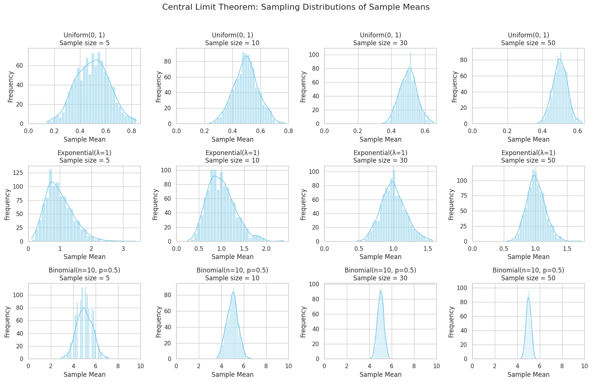

# Problem 1
# 🎯 Motivation

The **Central Limit Theorem (CLT)** is one of the most important results in statistics. It states that the distribution of sample means tends to follow a **normal distribution** as the **sample size increases**, regardless of the original population's distribution, provided the population has a **finite variance**.

Understanding the CLT is essential because it justifies why the normal distribution appears so frequently in statistics and science. It enables the use of **confidence intervals**, **hypothesis testing**, and many **modeling techniques**.

Simulations offer an intuitive way to observe how and why the CLT works.

---

# 1️⃣ Simulating Sampling Distributions (Conceptually)

We consider the following population distributions:

- **Uniform Distribution**: Every value within a range is equally likely.
- **Exponential Distribution**: Often models waiting times; it is positively skewed.
- **Binomial Distribution**: Discrete distribution modeling a fixed number of trials with success/failure outcomes.

From each of these populations, we draw many random samples (repeated sampling) of various sizes (e.g., 5, 10, 30, 50). For each sample, we calculate the **sample mean**.

By collecting the sample means over many repetitions (e.g., 1000 times), we construct the **sampling distribution of the sample mean** for each sample size.

---

# 2️⃣ Sampling and Visualization (Conceptual Description)

**Sample Sizes Considered:**
- Small: 5, 10  
- Moderate: 30  
- Large: 50  

### Conceptual Observations:

For each population distribution, we examine how the histogram of sample means behaves:

- With **small sample sizes**, the sampling distribution may resemble the **original population**'s shape.
- As the **sample size increases**, the sampling distribution of the sample mean becomes more **bell-shaped** and **symmetrical**, approaching a **normal distribution**.

---

### For Each Distribution:

#### A. Uniform Distribution
- **Original shape**: flat (equal probability across range).
- As sample size increases:
  - Sampling distribution becomes **smoother**.
  - Rapid **convergence to a normal shape**.

#### B. Exponential Distribution
- **Original shape**: highly **right-skewed**.
- Sampling distribution:
  - Initially retains skewness for small samples.
  - Gradually becomes **symmetric and bell-shaped** for larger samples.
  - Converges **more slowly** than the uniform case.

#### C. Binomial Distribution
- **Original shape**: discrete and **symmetric if** $p = 0.5$.
- As sample size increases:
  - Sampling distribution becomes **more continuous**.
  - Converges to a **normal shape** relatively quickly.

---

# 3️⃣ Parameter Exploration

### A. Effect of Original Distribution
- The more **skewed or non-normal** the population distribution is, the **slower** the convergence to normality.
- Uniform and binomial (with $p = 0.5$) converge quickly.
- Exponential, being skewed, requires **larger samples** to appear normal.

### B. Effect of Sample Size
- **Larger sample sizes** lead to:
  - **Narrower** sampling distributions.
  - **Closer approximation** to the normal distribution.

According to CLT:

$$
\text{Standard deviation of the sample mean} = \frac{\sigma}{\sqrt{n}}
$$

Where $\sigma$ is the **population standard deviation**, and $n$ is the **sample size**.

### C. Effect of Population Variance
- Populations with **larger variance** produce sampling distributions that are **more spread out**.
- However, the **square root rule** ensures that as sample size increases, the spread still **decreases**.

---

# 4️⃣ Practical Applications

### A. Estimating Population Parameters
Even if the population is **not normally distributed**, we can confidently estimate the **population mean** using sample data due to CLT.

### B. Quality Control in Manufacturing
Companies use sample means of product measurements (e.g., weight, size, voltage) to monitor production.  
CLT allows the use of **control charts** based on **normal distribution**.

### C. Predicting Outcomes in Finance
In portfolio theory, the **average return** over time is assumed to follow a **normal distribution**, enabling **risk prediction** and **option pricing**.

### D. Medical and Social Sciences
CLT justifies using **t-tests** and **confidence intervals** in **survey analysis** and **experimental research**.

---

# ✅ Conclusion

The Central Limit Theorem shows the remarkable fact that **sample means** will follow a **normal distribution** as **sample size increases**, regardless of how the underlying data is distributed.

From a theoretical and conceptual point of view:

- **Uniform** and **binomial** populations show **quick convergence** to normality.
- **Skewed distributions** (like exponential) converge more **slowly** but still follow the CLT.
- **Larger sample sizes** reduce variability and improve normal approximation.

The CLT is a **critical foundation** for many statistical methods used in **science, industry, economics**, and beyond.

---

## colab 

[solution](https://colab.research.google.com/drive/1Y8ooW1qSZpVIhneDtzyoEZ23CvHN_rS3?usp=sharing)
