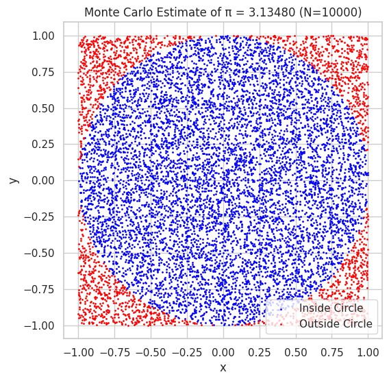
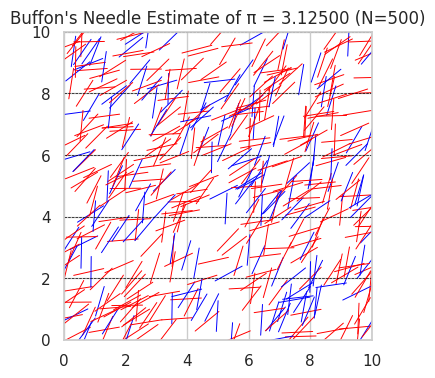

# Problem 2

# 🎯 Problem 2: Estimating $\pi$ Using Monte Carlo Methods

## 🎯 Motivation
The Monte Carlo method uses randomness to solve numerical problems, and one of its most elegant uses is estimating $\pi$. By modeling geometrical probability problems—like throwing darts at a circle or dropping needles on a plane—we can approximate $\pi$ without complex formulas.

This approach:
- Connects geometry, probability, and numerical analysis.
- Demonstrates how randomness can yield accurate results.
- Offers insight into convergence, accuracy, and computational cost.

---

## 🔵 Part 1: Estimating $\pi$ Using a Circle

### 1️⃣ Theoretical Foundation

Imagine a unit circle (radius = 1) inscribed in a square with sides of length 2 (from $-1$ to $1$ on both $x$ and $y$ axes).

- The area of the circle is:
  $$A_{\text{circle}} = \pi r^2 = \pi \cdot 1^2 = \pi$$
$$- The area of the square is:$$
  $$A_{\text{square}} = 2 \cdot 2 = 4$$

Now, if we randomly throw points into the square, the probability that a point lands inside the circle is:

$$
P = \frac{\text{Area of circle}}{\text{Area of square}} = \frac{\pi}{4}
$$

So, rearranging:

$$
\pi \approx 4 \cdot \left( \frac{\text{Number of points inside the circle}}{\text{Total number of points}} \right)
$$

---

### 2️⃣ Simulation Procedure (Conceptually)

- Generate many random points $(x, y)$ such that $x, y \in [-1, 1]$.
- A point lies inside the circle if:
  $$
  x^2 + y^2 \leq 1
  $$
- Count how many points satisfy this condition.
- Estimate $\pi$ using:
  $$
  \pi \approx 4 \cdot \frac{\text{Points inside the circle}}{\text{Total points generated}}
  $$

---

### 3️⃣ Visualization (Conceptually)

- Plot all generated points on a 2D plane.
- Color points **inside the circle** (satisfying $x^2 + y^2 \leq 1$) in one color (e.g., blue).
- Color points **outside the circle** in another color (e.g., red).
- The plot visually approximates the circle within the square.

---

### 4️⃣ Analysis

- Accuracy improves as the number of points increases.
- The estimate converges slowly; thousands to millions of points are often required for high accuracy.
- The method is simple but not computationally efficient compared to analytical formulas.
- The standard deviation of the estimate decreases proportionally to:
  $$
  \frac{1}{\sqrt{n}}
  $$
  where $n$ is the number of points.

---

## 🪡 Part 2: Estimating $\pi$ Using Buffon’s Needle

### 1️⃣ Theoretical Foundation

Buffon’s Needle is a classic probability problem:

- Imagine parallel lines spaced $d$ units apart.
- Drop a needle of length $l \leq d$ randomly on the plane.
- The probability that the needle crosses a line is:
  $$
  P = \frac{2l}{d\pi}
  $$
- Solving for $\pi$:
  $$
  \pi \approx \frac{2l \cdot N}{d \cdot C}
  $$

Where:
- $N$: Total number of needle drops
- $C$: Number of times the needle crosses a line

---

### 2️⃣ Simulation Procedure (Conceptually)

Set:
- Needle length $l = 1$
- Line spacing $d = 2$ (or any $d \geq l$)

For each needle drop:
- Randomly select the distance $y$ from the center of the needle to the nearest line, uniformly from $0$ to $d/2$.
- Randomly select the angle $\theta$ that the needle makes with the horizontal, uniformly from $0$ to $\pi/2$.
- The needle crosses a line if:
  $$
  y \leq \frac{l}{2} \sin(\theta)
  $$

Count how many times it crosses and use the formula to estimate $\pi$.

---

### 3️⃣ Visualization (Conceptually)

- Draw the parallel lines on the plane.
- Show the needles as line segments with random positions and angles.
- Highlight those that cross a line differently from those that don’t.

---

### 4️⃣ Analysis

- The estimate depends on geometry and angles—adds complexity compared to the circle method.
- Accuracy improves with more trials but convergence is typically slower than the circle method.
- Buffon’s Needle provides a real-world physical model for estimating $\pi$, making it useful for experimental probability.

---

## 📈 Comparison of Methods

| Feature                    | Circle-Based Monte Carlo        | Buffon’s Needle                     |
|---------------------------|----------------------------------|-------------------------------------|
| **Simplicity**            | Very simple and visual           | Requires angle and distance logic   |
| **Convergence Rate**      | Faster                           | Slower                              |
| **Physical Interpretation** | Geometrical                   | Physical experiment                 |
| **Efficiency**            | High for simulations             | Less efficient                      |
| **$\pi$ Estimation Formula** | $\pi \approx 4 \cdot \frac{M}{N}$ | $\pi \approx \frac{2l \cdot N}{d \cdot C}$ |

---
   

## colab 

[solution](https://colab.research.google.com/drive/1Y8ooW1qSZpVIhneDtzyoEZ23CvHN_rS3?usp=sharing)
